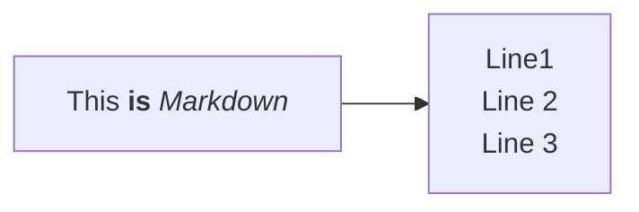
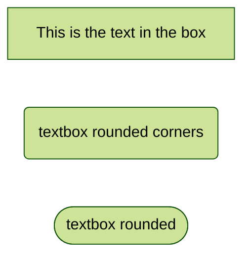

# mermaidTest
Test repo for Mermaid on github

## Mermaid examples

```mermaid
  graph TD;
      A-->B;
      A-->C;
      B-->D;
      C-->D;
```

```mermaid
%%{init: {"flowchart": {"htmlLabels": false}} }%%
flowchart LR
    markdown["`This **is** _Markdown_`"]
    newLines["`Line1
    Line 2
    Line 3`"]
    markdown --> newLines

```

## Nodes in diagrams

```mermaid
%%{init: {'theme':'forest'}}%%
flowchart LR

textbox1[This is the text in the box]
textbox2(textbox rounded corners)
textbox3([textbox rounded])


```
